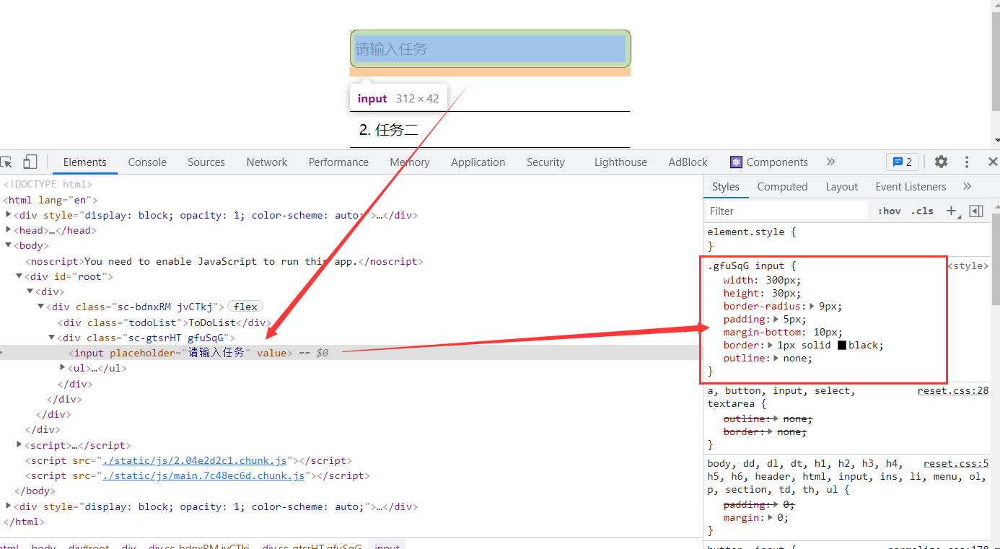

```HTML
<div classname="container">
    <div classname="todoList">
        ToDoList
    </div>
    <div>
        <input />
        <ol>
            <li>
            </li>
        </ol>
    </div>
</div>
```

- 类选择器 container 设置居中
- 类选择器 todoList 设置字号和位置
- 所有的元素不能用鼠标选中
- 鼠标在不同元素上的样式

### Input

- 有提示内容
- Enter键抬起，输入一个任务并清空输入

### LI

- 点击有删除线，再次点击清除删除线
- 右边按钮点击删除该项
- 鼠标上浮显示右边的按钮

### CSS 样式

可以右键检查，查看


